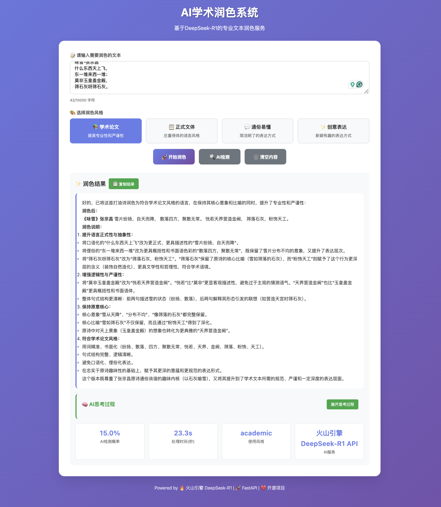
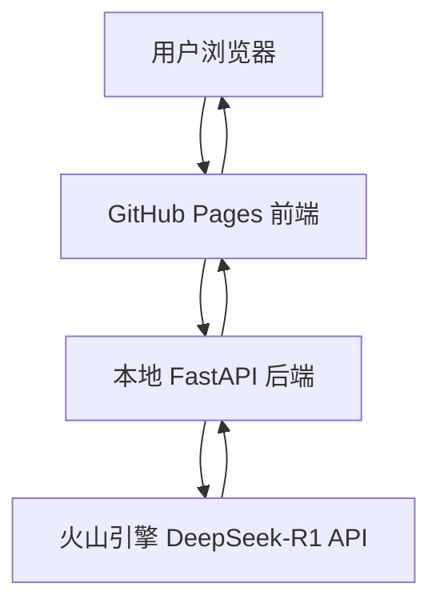

# AI学术润色系统

> 基于火山引擎 DeepSeek-R1 的专业文本润色、AI检测和风格转换服务


[](README.md)
[](README.CN.md)
[](https://github.com/ktwu01/AI-polish)
[](https://github.com/ktwu01/AI-polish/fork)

## 📋 项目概述

本项目为学生和研究人员提供AI文本润色服务，解决使用AI写作但担心AI查重的矛盾需求。

### **[立即访问网站：](https://ktwu01.github.io/1AI-polish)**



### 🎯 核心功能
- **🎨 多风格润色**：学术论文、正式文体、通俗易懂、创意表达
- **🔍 AI检测分析**：检测文本的AI生成概率并提供详细分析
- **🧠 思考过程展示**：显示DeepSeek-R1的深度推理过程
- **📊 实时统计**：处理时间、AI概率、使用的服务等指标

### 🏗️ 系统架构

**混合部署架构**：
- **前端**：本地部署/GitHub Pages 静态托管。
	- [] 目前正在开发 Render 部署模块。
- **后端**：FastAPI 服务 + Celery异步任务 + Redis缓存。
- **AI服务**：火山引擎 DeepSeek-R1 API
- [] **算法模块**：
	- [] 文本生成：OpenAI GPT-4 / Claude / GLM
	- [] AI检测：GPTZero、OpenAI Detect、自己训练的RoBERTa/BERT模型
	- [] 改写降重：结合句法改写 + Embedding相似度控制（Contrastive Tuning）
	- [] 数据安全合规：本地运行选项 / 云端临时缓存自动删除



## 🚀 快速开始
- [] 目前正在开发 Render 部署模块。开发完成 Render 后，即可以线上部署，不需要此模块。

### 📋 前置要求

- **Python 3.11+**
- **火山引擎账号**（用于DeepSeek-R1 API）
- **Git**

### 🔧 安装和配置

#### 1. 克隆项目
```bash
git clone https://github.com/ktwu01/1AI-polish.git
cd 1AI-polish
```

#### 2. 创建Python虚拟环境
```bash
# 创建虚拟环境
python -m venv fastapi_env

# 激活虚拟环境
# macOS/Linux:
source fastapi_env/bin/activate
# Windows:
# fastapi_env\Scripts\activate
```

#### 3. 安装依赖
```bash
pip install -r requirements.txt
```

#### 4. 配置火山引擎API
创建 `.env` 文件：
```bash
# 应用配置
APP_NAME="AI学术润色系统"
DEBUG=True
SECRET_KEY="your-secret-key-here-change-in-production"

# 数据库配置
DATABASE_URL="sqlite:///./ai_processor.db"

# Redis配置
REDIS_URL="redis://localhost:6379"

# 火山引擎 DeepSeek-R1 API 配置
ARK_API_KEY=你的火山引擎API密钥
ARK_BASE_URL=https://ark.cn-beijing.volces.com/api/v3
DEEPSEEK_MODEL_ID=deepseek-r1-250528
```

**获取火山引擎API密钥**：
1. 访问 [火山引擎控制台](https://console.volcengine.com/)
2. 开通 DeepSeek-R1 服务
3. 获取API密钥并配置到 `.env` 文件

## 🎮 使用方法

### 🚀 启动后端服务

在项目根目录下运行：
```bash
# 激活虚拟环境（如果还没激活）
source fastapi_env/bin/activate

# 启动FastAPI服务器
uvicorn app.main_production:app --reload --host 0.0.0.0 --port 8000
```

**成功启动后会显示**：
```
INFO:     Uvicorn running on http://0.0.0.0:8000
🚀 AI学术润色系统启动
✅ 火山引擎 API: 已配置
✅ 模型: deepseek-r1-250528
```

### 🌐 访问前端界面

**方式1：在线访问**（推荐）
- 访问：https://ktwu01.github.io/1AI-polish/
- 前端会自动连接到您本地的FastAPI服务

**方式2：本地访问**
```bash
# 在docs目录启动本地服务器
cd docs
python -m http.server 5500

# 访问：http://localhost:5500
```

### 📡 API接口使用

#### 核心API端点

**1. 文本润色** `POST /api/v1/process`
```bash
curl -X POST "http://localhost:8000/api/v1/process" \
     -H "Content-Type: application/json" \
     -d '{
       "content": "人工智能技术在学术写作中的应用越来越广泛",
       "style": "academic"
     }'
```

**响应示例**：
```json
{
  "original_text": "人工智能技术在学术写作中的应用越来越广泛",
  "processed_text": "人工智能技术在学术写作领域的应用日益普及...",
  "reasoning_content": "用户要求将文本润色为学术风格...",
  "ai_probability": 0.15,
  "processing_time": 18.5,
  "style_used": "academic",
  "api_used": "火山引擎 DeepSeek-R1 API"
}
```

**2. AI检测** `POST /api/v1/detect`
```bash
curl -X POST "http://localhost:8000/api/v1/detect" \
     -H "Content-Type: application/json" \
     -d '{"content": "要检测的文本内容"}'
```

**3. 获取支持的风格** `GET /api/v1/styles`
```bash
curl http://localhost:8000/api/v1/styles
```

**4. 批量处理** `POST /api/v1/batch`
```bash
curl -X POST "http://localhost:8000/api/v1/batch" \
     -H "Content-Type: application/json" \
     -d '{
       "texts": [
         {"content": "第一段文本", "style": "academic"},
         {"content": "第二段文本", "style": "formal"}
       ]
     }'
```

**5. 健康检查** `GET /api/v1/health`
```bash
curl http://localhost:8000/api/v1/health
```

#### 支持的润色风格

| 风格ID | 风格名称 | 描述 | 适用场景 |
|--------|----------|------|----------|
| `academic` | 学术论文 | 提高专业性和严谨性 | 学术论文、研究报告 |
| `formal` | 正式文体 | 庄重得体的语言风格 | 商务文档、正式场合 |
| `casual` | 通俗易懂 | 简洁明了的表达方式 | 科普文章、一般阅读 |
| `creative` | 创意表达 | 新颖有趣的表达方式 | 创意写作、营销文案 |

## 📁 项目结构

```
1AI-polish/
├── app/                        # 后端应用
│   ├── __init__.py
│   ├── main_production.py      # 生产版主程序 ⭐
│   ├── main_debug.py          # 调试版主程序
│   ├── api/                   # API路由
│   │   └── v1/
│   │       └── endpoints.py   # API端点定义
│   ├── core/                  # 核心配置
│   │   └── config.py         # 应用配置
│   ├── models/                # 数据模型
│   │   ├── database.py       # 数据库模型
│   │   └── schemas.py        # Pydantic模型
│   ├── services/              # 业务服务
│   │   ├── deepseek_processor.py  # DeepSeek处理器 ⭐
│   │   └── celery_app.py     # 异步任务
│   └── utils/                 # 工具模块
├── docs/                      # 前端文件
│   └── index.html            # 前端界面 ⭐
├── tests/                     # 测试文件
├── fastapi_env/              # Python虚拟环境
├── requirements.txt          # Python依赖
├── .env                      # 环境变量（需要创建）
├── .gitignore               # Git忽略文件
└── README.md                # 项目文档
```

## 🔧 开发指南

### 🛠️ 本地开发

1. **启动后端服务**：
```bash
uvicorn app.main_production:app --reload --host 0.0.0.0 --port 8000
```

2. **启动前端服务**：
```bash
cd docs
python -m http.server 5500
```

3. **查看API文档**：
   - Swagger UI: http://localhost:8000/docs
   - ReDoc: http://localhost:8000/redoc

### 🧪 测试

```bash
# 运行测试
pytest tests/ -v

# 测试API端点
curl http://localhost:8000/api/v1/health
```

### 📊 日志查看

后端启动时会显示详细日志：
```
2025-06-30 19:55:55,517 - app.main_production - INFO - 🚀 AI学术润色系统启动
2025-06-30 19:55:55,517 - app.main_production - INFO - ✅ 火山引擎 API: 已配置
2025-06-30 19:55:55,517 - app.main_production - INFO - ✅ 模型: deepseek-r1-250528
```

## 🌐 部署

### 🏠 本地部署（当前模式）

**优势**：
- ✅ API密钥安全（不会暴露到公网）
- ✅ 完全免费
- ✅ 响应速度快
- ✅ 完全控制

**使用方法**：
1. 本地启动FastAPI服务
2. 访问GitHub Pages前端
3. 前端自动连接本地后端

### ☁️ 云端部署（可选）

如需完全云端部署，可以使用：

**Render（推荐）**：
1. 在Render中创建Web Service
2. 连接GitHub仓库
3. 配置环境变量
4. 更新前端API地址

**其他平台**：
- Vercel
- Railway
- Heroku
- Fly.io

## ⚠️ 注意事项

### 🔒 安全提醒
- **不要**将 `.env` 文件提交到Git仓库
- **不要**在前端代码中硬编码API密钥
- API密钥应妥善保管，不要分享给他人

### 🚀 性能说明
- DeepSeek-R1 处理时间通常为10-30秒
- 复杂文本需要更长处理时间
- 建议前端显示进度提示

### 💰 费用说明
- 火山引擎提供免费额度
- 超出免费额度后按使用量计费
- 建议监控API使用量

## 🐛 故障排除

### 常见问题

**1. API调用失败**
```bash
# 检查API密钥配置
cat .env | grep ARK_API_KEY

# 测试API连接
curl -X POST "https://ark.cn-beijing.volces.com/api/v3/chat/completions" \
     -H "Authorization: Bearer 你的API密钥" \
     -H "Content-Type: application/json" \
     -d '{"model": "deepseek-r1-250528", "messages": [{"role": "user", "content": "测试"}]}'
```

**2. 前端无法连接后端**
```bash
# 检查后端是否运行
curl http://localhost:8000/api/v1/health

# 检查端口占用
lsof -i :8000
```

**3. 虚拟环境问题**
```bash
# 重新创建虚拟环境
rm -rf fastapi_env
python -m venv fastapi_env
source fastapi_env/bin/activate
pip install -r requirements.txt
```

## 🤝 贡献指南

欢迎提交Issue和Pull Request！

### 开发流程
1. Fork本仓库
2. 创建特性分支
3. 提交更改
4. 创建Pull Request

### 代码规范
- Python代码遵循PEP 8
- 提交消息使用中文
- 添加适当的注释和文档

## 📝 更新日志

### v1.0.0 (2025-06-30)
- ✅ 完成DeepSeek-R1 API集成
- ✅ 实现多风格文本润色功能
- ✅ 添加AI检测分析
- ✅ 支持思考过程显示
- ✅ 混合部署架构（GitHub Pages + 本地FastAPI）
- ✅ 完善的前端界面

## 📄 许可证

本项目采用 MIT 许可证。详见 [LICENSE](LICENSE) 文件。

## 📞 联系方式

- **项目地址**：https://github.com/ktwu01/1AI-polish
- **在线演示**：https://ktwu01.github.io/1AI-polish/
- **问题反馈**：[GitHub Issues](https://github.com/ktwu01/1AI-polish/issues)

## 🙏 致谢

- **火山引擎**：提供DeepSeek-R1 API服务
- **FastAPI**：优秀的Python Web框架
- **GitHub Pages**：免费的静态网站托管
- **所有贡献者**：感谢每一位参与项目的开发者

---

**🎉 开始您的AI学术润色之旅吧！**

> 如果这个项目对您有帮助，请给个 ⭐ Star 支持一下！