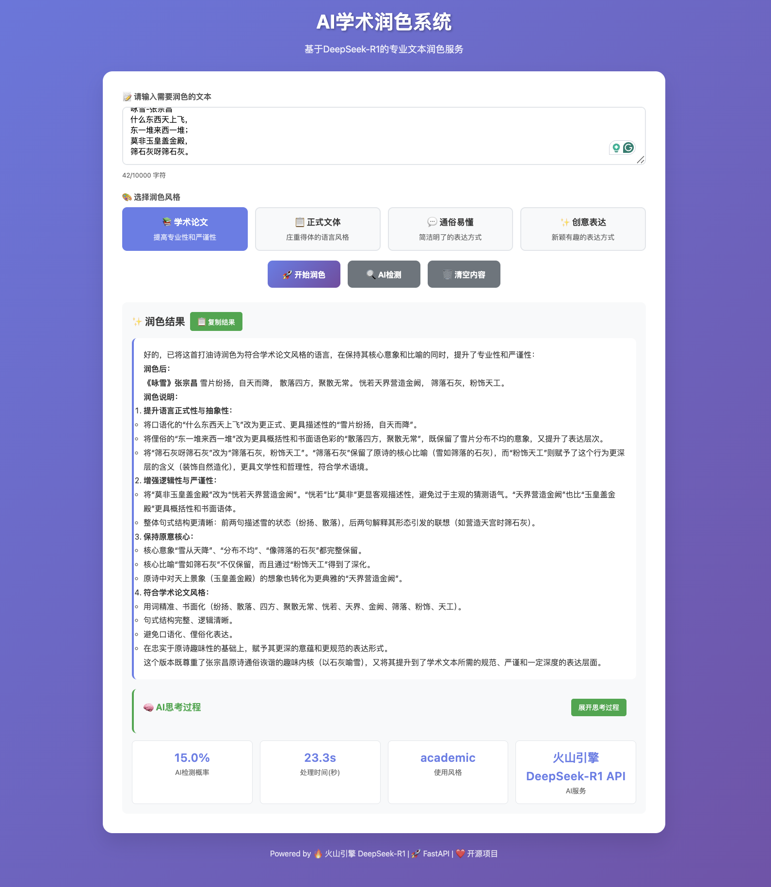

# AI Academic Polishing System


> Professional text polishing, AI detection, and style conversion services based on Volcano Engine's DeepSeek-R1


[](README.md)
[](README.CN.md)
[](https://github.com/ktwu01/1AI-polish)
[](https://github.com/ktwu01/1AI-polish/fork)


## Project Overview

This project provides AI text polishing services for students and researchers to address the conflicting needs of using AI for writing while worrying about AI plagiarism detection.

# **[Visit the website now:](https://ktwu01.github.io/1AI-polish)**


Usage example:


### Core Functions
- **Multi-style polishing**: academic papers, formal style, easy-to-understand, creative expression
- **AI detection and analysis**: detect the probability of AI-generated text and provide detailed analysis
- **Thinking process display**: show the deep reasoning process of DeepSeek-R1
- **Real-time statistics**: processing time, AI probability, services used, and other indicators

### System Architecture

**Hybrid deployment architecture**:
- **Frontend**: Local deployment/GitHub Pages frontend static hosting.
- **Backend**: Local deployment/Render backend deployment module. FastAPI service + Celery asynchronous tasks + Redis cache.
- **AI service**: Volcano Engine DeepSeek-R1 API
- **Algorithm module**:
	- Text generation: OpenAI GPT-4 / Claude / GLM
	- AI detection: GPTZero, OpenAI Detect, self-trained RoBERTa/BERT model
	- Paraphrasing and reduction: combined with syntactic paraphrasing + Embedding similarity control (Contrastive Tuning)
	- Data security and compliance: local running option / cloud temporary cache automatic deletion


## Quick Start
- [x] The Render deployment module has been developed. It can be deployed online.

### Prerequisites

- **Python 3.11+**
- **Volcano Engine account** (for DeepSeek-R1 API)
- **Git**

### Installation and Configuration

#### 1. Clone the project
```bash
git clone https://github.com/ktwu01/1AI-polish.git
cd 1AI-polish
```

#### 2. Create a Python virtual environment
```bash
# Create a virtual environment
python -m venv fastapi_env

# Activate the virtual environment
# macOS/Linux:
source fastapi_env/bin/activate
# Windows:
# fastapi_env\Scripts\activate
```

#### 3. Install dependencies
```bash
pip install -r requirements.txt
```

#### 4. Configure Volcano Engine API
Create a `.env` file:
```bash
# Application configuration
APP_NAME="AI Academic Polishing System"
DEBUG=True
SECRET_KEY="your-secret-key-here-change-in-production"

# Database configuration
DATABASE_URL="sqlite:///./ai_processor.db"

# Redis configuration
REDIS_URL="redis://localhost:6379"

# Volcano Engine DeepSeek-R1 API configuration
ARK_API_KEY=your-volcano-engine-api-key
ARK_BASE_URL=https://ark.cn-beijing.volces.com/api/v3
DEEPSEEK_MODEL_ID=deepseek-r1-250528
```

**Get Volcano Engine API key**:
1. Visit [Volcano Engine Console](https://console.volcengine.com/)
2. Activate DeepSeek-R1 service
3. Get the API key and configure it in the `.env` file

## Usage

### Start the backend service

Run in the project root directory:
```bash
# Activate the virtual environment (if not already activated)
source fastapi_env/bin/activate

# Start the FastAPI server
uvicorn app.main_production:app --reload --host 0.0.0.0 --port 8000
```

**After successful startup, it will display**:
```
INFO:     Uvicorn running on http://0.0.0.0:8000
AI Academic Polishing System started
Volcano Engine API: configured
Model: deepseek-r1-250528
```

### Access the frontend interface

**Method 1: Online access** (recommended)
- Visit: https://ktwu01.github.io/1AI-polish/
- The frontend will automatically connect to your local FastAPI service

**Method 2: Local access**
```bash
# Start a local server in the docs directory
cd docs
python -m http.server 5500

# Visit: http://localhost:5500
```

### API Usage

#### Core API Endpoints

**1. Text polishing** `POST /api/v1/process`
```bash
curl -X POST "http://localhost:8000/api/v1/process" \
     -H "Content-Type: application/json" \
     -d '{
       "content": "The application of artificial intelligence technology in academic writing is becoming more and more widespread",
       "style": "academic"
     }'
```

**Response example**:
```json
{
  "original_text": "The application of artificial intelligence technology in academic writing is becoming more and more widespread",
  "processed_text": "The application of artificial intelligence technology in the field of academic writing is becoming increasingly popular...",
  "reasoning_content": "The user requested to polish the text into an academic style...",
  "ai_probability": 0.15,
  "processing_time": 18.5,
  "style_used": "academic",
  "api_used": "Volcano Engine DeepSeek-R1 API"
}
```

**2. AI detection** `POST /api/v1/detect`
```bash
curl -X POST "http://localhost:8000/api/v1/detect" \
     -H "Content-Type: application/json" \
     -d '{"content": "Text content to be detected"}'
```

**3. Get supported styles** `GET /api/v1/styles`
```bash
curl http://localhost:8000/api/v1/styles
```

**4. Batch processing** `POST /api/v1/batch`
```bash
curl -X POST "http://localhost:8000/api/v1/batch" \
     -H "Content-Type: application/json" \
     -d '{
       "texts": [
         {"content": "First paragraph of text", "style": "academic"},
         {"content": "Second paragraph of text", "style": "formal"}
       ]
     }'
```

**5. Health check** `GET /api/v1/health`
```bash
curl http://localhost:8000/api/v1/health
```

#### Supported polishing styles

| Style ID | Style Name | Description | Applicable Scenarios |
|---|---|---|---|
| `academic` | Academic paper | Improve professionalism and rigor | Academic papers, research reports |
| `formal` | Formal style | Solemn and decent language style | Business documents, formal occasions |
| `casual` | Easy to understand | Concise and clear expression | Popular science articles, general reading |
| `creative` | Creative expression | Novel and interesting expression | Creative writing, marketing copy |

## Project Structure

```
1AI-polish/
├── app/ # Backend application
│ ├── __init__.py
│ ├── main_production.py # Production main program
│ ├── main.py # Local development main program
│ ├── api/ # API routing
│ │ └── v1/
│ │ └── endpoints.py # API endpoint definition
│ ├── core/ # Core configuration
│ │ └── config.py # Application configuration
│ ├── models/ # Data models
│ │ ├── database.py # Database models
│ │ └── schemas.py # Pydantic models
│ ├── services/ # Business services
│ │ ├── deepseek_processor.py # DeepSeek processor
│ │ └── celery_app.py # Asynchronous tasks
│ └── utils/ # Utility modules
├── docs/ # Frontend files
│ └── index.html # Frontend interface
├── tests/ # Test files
├── fastapi_env/ # Python virtual environment
├── requirements.txt # Python dependencies
├── .env # Environment variables (need to be created)
├── .gitignore # Git ignore file
└── README.md # Project documentation
```

## Development Guide

### Local Development

1. **Start the backend service**:
```bash
uvicorn app.main_production:app --reload --host 0.0.0.0 --port 8000
```

2. **Start the frontend service**:
```bash
cd docs
python -m http.server 5500
```

3. **View API documentation**:
   - Swagger UI: http://localhost:8000/docs
   - ReDoc: http://localhost:8000/redoc

### Testing

```bash
# Run tests
pytest tests/ -v

# Test API endpoint
curl http://localhost:8000/api/v1/health
```

### Log Viewing

Detailed logs will be displayed when the backend starts:
```
2025-06-30 19:55:55,517 - app.main_production - INFO - AI Academic Polishing System started
2025-06-30 19:55:55,517 - app.main_production - INFO - Volcano Engine API: configured
2025-06-30 19:55:55,517 - app.main_production - INFO - Model: deepseek-r1-250528
```

## Deployment

### Local Deployment (current mode)

**Advantages**:
- API key security (will not be exposed to the public network)
- Completely free
- Fast response
- Full control

**Usage**:
1. Start the FastAPI service locally
2. Access the GitHub Pages frontend
3. The frontend automatically connects to the local backend

### Cloud Deployment (optional)

For full cloud deployment, you can use:

**Render (recommended)**:
1. Create a Web Service in Render
2. Connect to the GitHub repository
3. Configure environment variables
4. Update the frontend API address

**Other platforms**:
- Vercel
- Railway
- Heroku
- Fly.io

## Notes

### Security Reminder
- **Do not** commit the `.env` file to the Git repository
- **Do not** hardcode the API key in the frontend code
- The API key should be kept properly and not shared with others

### Performance Description
- DeepSeek-R1 processing time is usually 10-30 seconds
- Complex text requires longer processing time
- It is recommended to display a progress prompt on the frontend

### Cost Description
- Volcano Engine provides a free quota
- After exceeding the free quota, it will be billed according to usage
- It is recommended to monitor API usage

## Troubleshooting

### Common Problems

**1. API call failed**
```bash
# Check API key configuration
cat .env | grep ARK_API_KEY

# Test API connection
curl -X POST "https://ark.cn-beijing.volces.com/api/v3/chat/completions" \
     -H "Authorization: Bearer your-api-key" \
     -H "Content-Type: application/json" \
     -d '{"model": "deepseek-r1-250528", "messages": [{"role": "user", "content": "test"}]}'
```

**2. Frontend cannot connect to backend**
```bash
# Check if the backend is running
curl http://localhost:8000/api/v1/health

# Check port usage
lsof -i :8000
```

**3. Virtual environment issues**
```bash
# Recreate the virtual environment
rm -rf fastapi_env
python -m venv fastapi_env
source fastapi_env/bin/activate
pip install -r requirements.txt
```

## Contribution Guide

Contributions, issues and feature requests are welcome!

### Development Process
1. Fork this repository
2. Create a feature branch
3. Commit your changes
4. Create a Pull Request

### Code Style
- Python code follows PEP 8
- Commit messages use Chinese
- Add appropriate comments and documentation

## Update Log

### v1.0.0 (2025-06-30)
- Completed DeepSeek-R1 API integration
- Implemented multi-style text polishing function
- Added AI detection and analysis
- Supported thinking process display
- Hybrid deployment architecture (GitHub Pages + local FastAPI)
- Complete frontend interface

## License

This project is licensed under the MIT License. See the [LICENSE](LICENSE) file for details.

## Contact

- **Project address**: https://github.com/ktwu01/1AI-polish
- **Online demo**: https://ktwu01.github.io/1AI-polish/
- **Issue feedback**: [GitHub Issues](https://github.com/ktwu01/1AI-polish/issues)

## Acknowledgements

- **Volcano Engine**: provides DeepSeek-R1 API service
- **FastAPI**: excellent Python Web framework
- **GitHub Pages**: free static website hosting
- **All contributors**: thank every developer who participated in the project

---

**Start your AI academic polishing journey!**

> If this project is helpful to you, please give it a Star to support it!